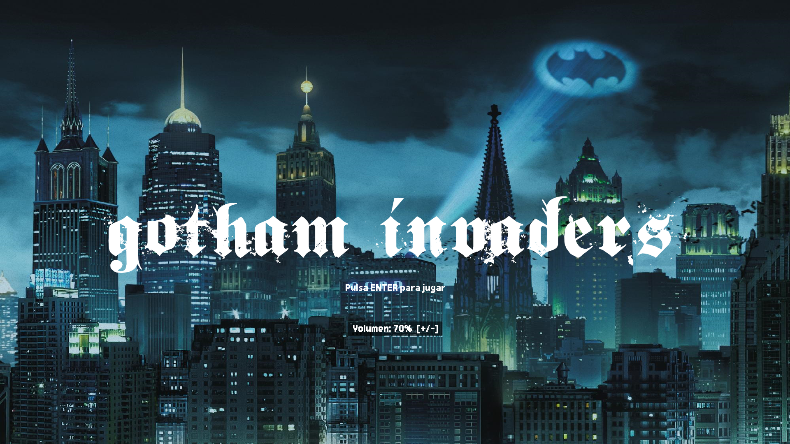
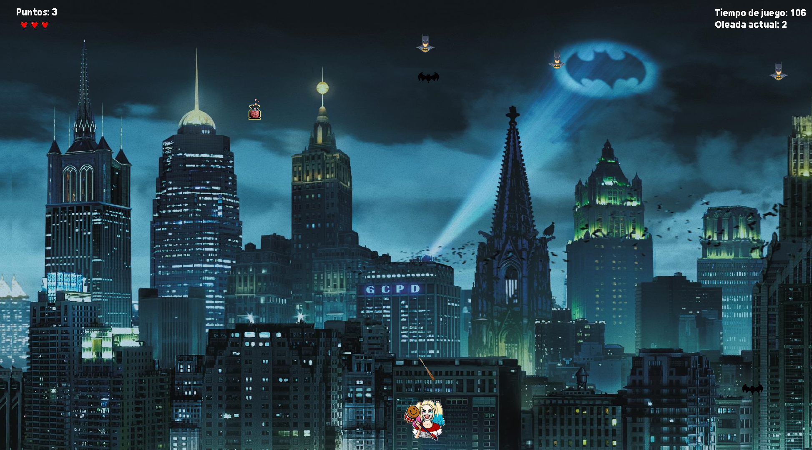
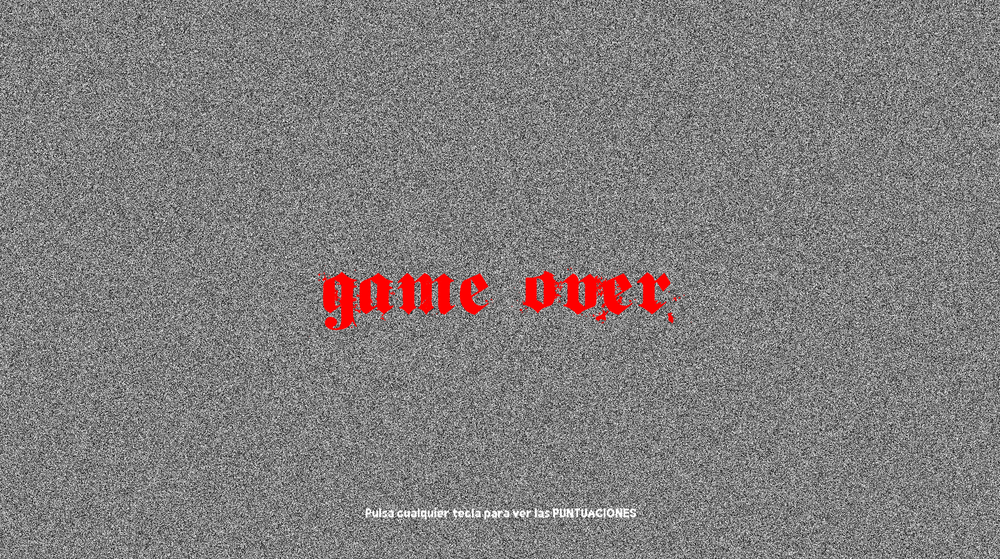

# 🏙 GOTHAM INVADERS 🏙

> Juego tipo Space Invaders con temática de Batman / Harley Quinn, desarrollado en Python con pygame como proyecto de primer año de DAM.

[](https://jessicafg90.itch.io/gotham-invaders)

---

## 📸 Capturas

<!-- Añade aquí capturas de pantalla del juego -->
<!--  -->
<!--  -->
<!--  -->

---

## 🎮 Descripción

Gotham Invaders es un videojuego de arcade desarrollado con Python y pygame. El jugador controla a Harley Quinn, que debe eliminar oleadas de Batmans lanzando su bate de béisbol. El juego cuenta con 10 oleadas de dificultad progresiva, sistema de vidas con corazones, power-ups, tabla de puntuaciones y pantallas animadas de victoria y Game Over.

---

## ✨ Características

- 10 oleadas de dificultad progresiva
- Movimiento horizontal en oleadas 1-5 y diagonal en oleadas 6-10
- Sistema de 3 vidas con corazones en el HUD
- Disparos del jugador con rotación animada (bate de béisbol)
- Disparos enemigos con cooldown individual por enemigo
- Power-ups de vida extra (pociones) a partir de la oleada 2
- Puntuación, temporizador y número de oleada en pantalla
- Pantalla de Game Over con efecto de estática de televisión
- Pantalla de victoria con animación de confeti
- Top 10 de puntuaciones guardado en archivo local
- Entrada de nombre estilo arcade (3 letras)
- Música de fondo en bucle con control de volumen (+/-)
- Efectos de sonido para disparo, impacto, power-ups y cambio de oleada
- Menú principal y menú de pausa con opción de salida (tecla Q)
- Pantalla de introducción de nombre con cursor parpadeante
- Pantalla completa adaptativa a la resolución del monitor

---

## 🕹️ Controles

| Tecla | Acción |
|-------|--------|
| ← → | Mover a Harley Quinn |
| Espacio | Disparar el bate |
| ESC | Pausar / Reanudar |
| Q | Salir al escritorio (desde el menú de pausa) |
| + / - | Subir / Bajar volumen |
| ENTER | Confirmar en menús |
| BACKSPACE | Borrar letra en el nombre |

---

## 🛠️ Tecnologías

- Python 3.12
- pygame 2.6.1
- numpy (para el efecto de estática)

---

## 📁 Estructura del proyecto

```
gotham_invaders/
│
├── gotham_invaders_game.py   # Código principal del juego
├── README.md                 # Este archivo
├── puntuaciones.txt          # Tabla de puntuaciones (se crea automáticamente)
├── .gitignore
│
├── Img/                      # Sprites e imágenes
│   ├── gotham.png
│   ├── harley.png
│   ├── batman.png
│   ├── bate.png
│   ├── vida_llena.png
│   ├── vida_vacia.png
│   ├── murcielago.png
│   └── potion_bottle_shine.png
│
├── Sonidos/                  # Efectos de sonido y música
│   ├── arcade.mp3
│   ├── whoosh.mp3
│   ├── slime.mp3
│   ├── potion-music.wav
│   ├── potion-drink.wav
│   ├── glitter-sparkle.mp3
│   └── level_complete.mp3
│
└── Fuentes/                  # Fuentes tipográficas
    ├── Gothical.ttf
    └── ari.ttf
```

---

## 🚀 Instalación y ejecución

### Opción A — Ejecutable (recomendado)

Descarga el `.exe` desde [itch.io](https://jessicafg90.itch.io/gotham-invaders) y ejecútalo directamente. No necesitas instalar Python ni ninguna dependencia.

### Opción B — Desde el código fuente

#### Requisitos previos

- Python 3.12 o superior
- pip

#### Pasos

1. Clona el repositorio:
```bash
git clone https://github.com/JessicaFG90/gotham_invaders.git
cd gotham_invaders
```

2. Instala las dependencias:
```bash
pip install pygame numpy
```

3. Ejecuta el juego:
```bash
py gotham_invaders_game.py
```

### Generar el ejecutable

Si quieres compilar el `.exe` tú mismo desde el código fuente, instala PyInstaller y ejecuta:

```bash
pip install pyinstaller
pyinstaller --onefile --noconsole --add-data "Img;Img" --add-data "Sonidos;Sonidos" --add-data "Fuentes;Fuentes" gotham_invaders_game.py
```

El ejecutable se generará en la carpeta `dist/`.

---

## 🎯 Mecánicas del juego

### Oleadas
El juego tiene 10 oleadas. Cada oleada añade enemigos y aumenta la velocidad:
- Oleadas 1-5: movimiento horizontal clásico, +2 enemigos por oleada
- Oleadas 6-10: movimiento diagonal, +1 enemigo por oleada, menor frecuencia de disparo

### Power-ups
A partir de la oleada 2 aparecen 2 pociones de vida extra por oleada. Permanecen en pantalla 7 segundos antes de desaparecer. Recogerlas suma 1 vida hasta el máximo de 3.

### Puntuación
Se suma 1 punto por cada enemigo eliminado con el bate. Al finalizar la partida (victoria o Game Over) se registra el nombre, puntos, tiempo y oleada alcanzada en el Top 10.

---

## 👩‍💻 Autora

**Jessica Fort González**  
Estudiante de DAM
GitHub: [@JessicaFG90](https://github.com/JessicaFG90)  
itch.io: [jessicafg90.itch.io](https://jessicafg90.itch.io)

---

## 📝 Licencia

Proyecto educativo desarrollado como práctica de primer año de DAM. Las imágenes, sonidos y fuentes utilizados son de uso libre o sin copyright.
